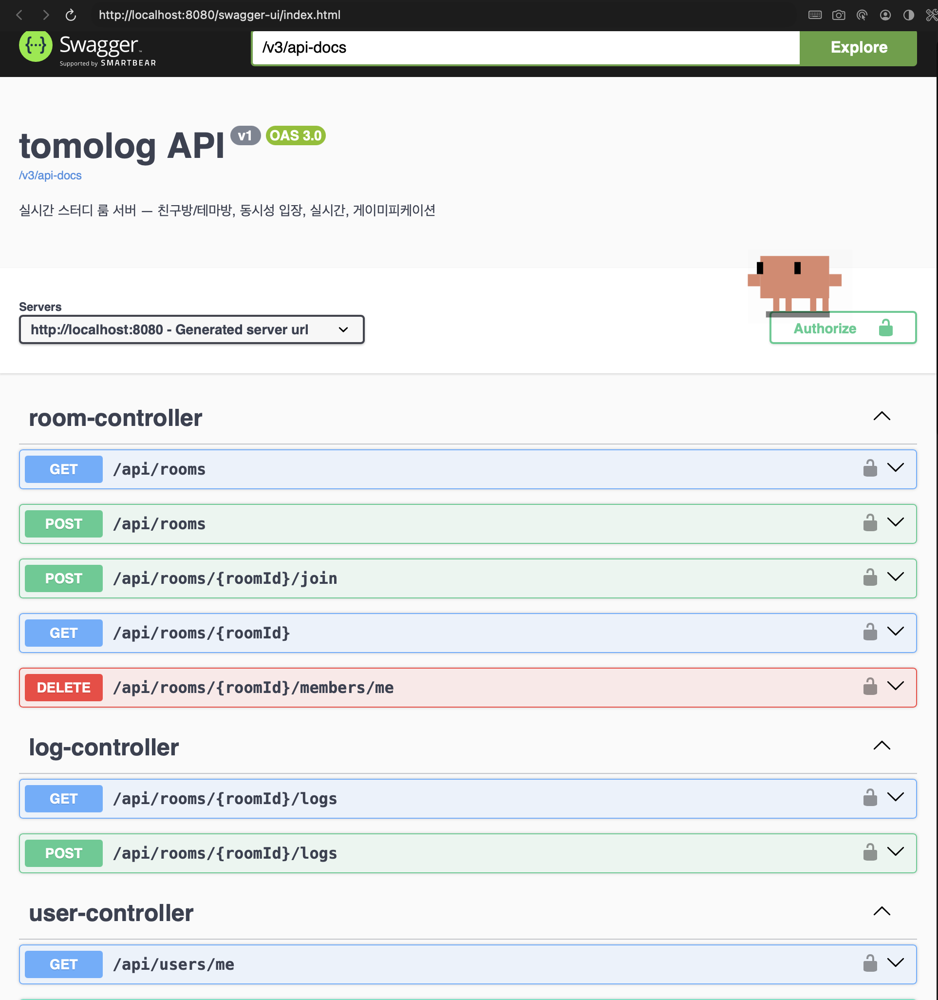
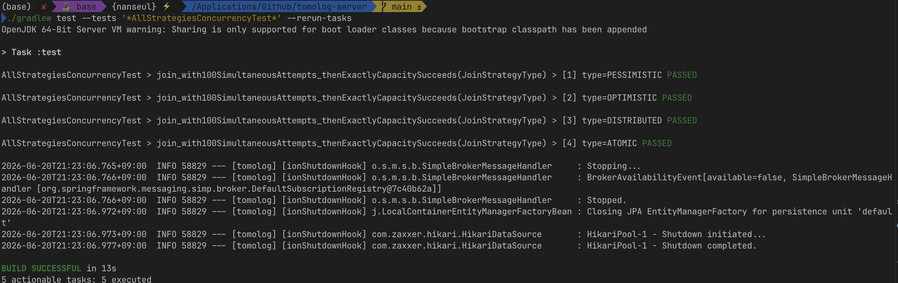
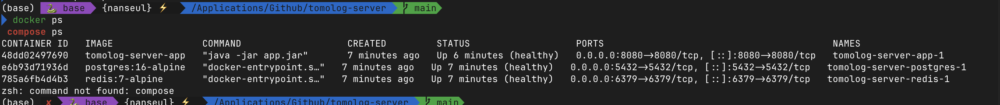

# tomolog — 실시간 스터디 룸 서버

```
학번:    <YOUR_ID>
이름:    <YOUR_NAME>
과제명:  tomolog — 실시간 스터디 룸 서버
GitHub:  https://github.com/seulnan/tomolog-server
```

친구들끼리, 또는 모르는 사람들과 함께 공부하는 실시간 스터디 룸 서버다. 방(로그)을 만들어 공유
포모도로 타이머로 같이 집중하고, 서로의 접속 상태를 실시간으로 보며, 한 사이클이 끝나면 공부
스냅샷(이모지 + 한 줄 메모 + 공부한 분)을 남겨 방 피드에 쌓는다. 매일 공부하면 스트릭이 오르고
조건을 채우면 뱃지를 받고, 방마다 같이 키우는 펫이 성장한다. 이 과제는 서버만 만드는 범위이고,
프론트엔드는 포함하지 않는다. 대신 REST와 STOMP, 그리고 자동화된 테스트로 전부 검증 가능하게 했다.


## 설계 목표와 핵심 결정

처음 스펙(`SPEC.md`)을 잡을 때 목표를 세 가지로 적고 순서를 매겼다. 첫째가 **동시성에서의
정확성** — 100명이 동시에 들어와도 방 정원은 절대 넘지 않는다. 이게 이 프로젝트의 간판 기능이다.
둘째는 동시성 제어·실시간 메시징·OAuth2·계층형 테스트 같은 백엔드 기술을 깔끔하게 보여주는 것,
셋째는 실제 서비스처럼 읽히는 코드였다. 정확성을 1순위로 둔 건, 기능이 많아 보이는 것보다 "보이지
않는 곳에서 데이터가 안 깨지는 것"이 이 서비스의 본질이라고 봤기 때문이다.

이 목표를 잡고 내린 결정들을, 왜 그렇게 했고 다른 선택지는 왜 접었는지와 함께 정리한다. 결정의
전체 기록은 `docs/DECISIONS.md`(의사결정 원장)에 번호를 붙여 남겨 뒀다.

**방을 두 종류로 나눈 것 (LEDGER-008).** 처음엔 방이 한 종류였는데, "정원은 누가 정하나"를
고민하다 두 종류가 필요하다고 판단했다. 하나는 친구방으로, 호스트가 만들고 정원을 정하며 최대
50명까지 아는 사람끼리 쓴다. 다른 하나는 테마방으로, 미리 만들어 둔 5개의 큰 방(분위기 좋은
카페 같은)에 모르는 사람 다수가 모여 최대 2000명까지 같이 공부한다. 둘을 나눈 진짜 이유는 동시성
성격이 다르기 때문이다. 50명짜리 방은 행을 잠가 한 명씩 처리해도 충분하지만, 2000명이 한 방에
몰리면 그 방식이 병목이 된다(자세한 건 동시성·부하 절에서). 모든 방을 같은 전략으로 처리하는 안과
아예 서비스를 물리적으로 쪼개는 안도 생각했지만, 전자는 큰 방에서 막히고 후자는 과제 범위에
과해서, 방 종류에 따라 입장 전략만 갈아끼우는 쪽으로 정했다.

**DB를 PostgreSQL로 바꾼 것 (LEDGER-006).** 원본 과제 스펙은 MySQL이었다. 나중에 Supabase·Neon
같은 매니지드 호스팅에 그대로 올릴 가능성을 열어두고 싶어서 PostgreSQL로 바꿨다. 다만 매니지드
서비스가 제공하는 인증·실시간 기능은 일부러 쓰지 않고 OAuth2와 STOMP를 직접 구현했다 — 그게 이
과제에서 보여줘야 할 부분이라고 봤기 때문이다.

**4계층 + 헥사고날 구조로 간 것 (LEDGER-007, LEDGER-010).** 핵심 규칙(정원·스트릭)이 JPA 엔티티
안에 영속성 코드와 섞이는 게 싫었다. 그래서 계층을 presentation / application / domain /
infrastructure로 나누고, 도메인은 순수 자바 객체로만 두는 헥사고날 구조를 택했다. 매퍼 없이
엔티티를 그대로 도메인으로 쓰는 안이 코드는 적지만, DB나 프레임워크가 바뀔 때 규칙까지 흔들리는
게 마음에 걸려 분리하는 쪽을 골랐다. 이 결정은 뒤에서 더티 체킹 함정이라는 대가를 치르게 했는데,
그 이야기는 "만들면서 부딪힌 문제들"에 적었다.


## 아키텍처와 기능 흐름

코드는 위에서 아래로만 의존한다. presentation은 application을, application은 domain을 의존하고,
infrastructure는 가장 바깥에서 안쪽을 향해서만 붙는다. 그리고 가장 중요한 domain은 아무것도
의존하지 않는다 — 스프링도 JPA도 모른다. 이 방향 규칙은 말로만 지키는 게 아니라 ArchUnit
테스트로 강제해서, 누가 실수로 거꾸로 의존하면 빌드가 깨진다.

```
com.tomolog
├── presentation    REST 컨트롤러 + STOMP 핸들러. 바깥과는 DTO(record)로만 주고받는다.
├── application     서비스(유스케이스). 트랜잭션 경계와 입장 전략 라우팅.
├── domain          순수 도메인 모델 + 포트(리포지토리 인터페이스). 프레임워크 의존 0.
└── infrastructure  바깥쪽 어댑터(안으로만 의존).
                    persistence(JPA 엔티티·매퍼·어댑터) / concurrency(입장 전략) / jwt·oauth·security
```

애그리거트마다 도메인 모델, 포트, JPA 엔티티, 매퍼, 영속성 어댑터 다섯 조각으로 나눴다. 예를 들어
방은 `domain/room/Room`이 규칙만 담고, 실제 저장은 `infrastructure/persistence/room`의 엔티티와
어댑터가 맡는다. 도메인은 자기가 정의한 포트 인터페이스만 알고, 그 구현이 바깥에 있다는 사실조차
모른다.

이게 실제로 어떻게 흐르는지, 공부 스냅샷을 제출하는 기능으로 따라가 보면 이렇다.

```
POST /api/rooms/{id}/logs            presentation — 컨트롤러가 요청 record를 받아 풀어 넘긴다
        │
        ▼
LogService.submit (application, @Transactional)
   ├─ 방 멤버인지 확인        domain 포트: roomMemberRepository
   ├─ 스냅샷 저장            domain 포트: entryRepository.save → 어댑터 → DB
   ├─ 게이미피케이션 반영     gamificationService (스트릭·방펫 갱신)
   └─ NewLogEvent 발행       eventPublisher
                                 │
                                 ▼
              realtime 리스너가 받아 /topic/rooms/{id} 로 NEW_LOG 브로드캐스트
```

```java
// application/log/LogService — 한 흐름 안에 저장·게이미피케이션·이벤트가 모인다
@Transactional
public LogResponse submit(Long roomId, Long userId, int cycleNumber, String emoji,
                          String memo, int studiedMinutes, LocalDateTime now) {
  if (!roomMemberRepository.existsByRoomIdAndUserId(roomId, userId)) {
    throw new ApiException(ErrorCode.NOT_ROOM_MEMBER);
  }
  TomologEntry entry = entryRepository.save(
      new TomologEntry(roomId, userId, cycleNumber, emoji, memo, studiedMinutes));
  gamificationService.recordStudy(userId, roomId, studiedMinutes, now);
  eventPublisher.publishEvent(new NewLogEvent(roomId, LogResponse.from(entry)));
  return LogResponse.from(entry);
}
```

여기서 눈여겨볼 부분은, 스냅샷을 저장한 서비스가 실시간 브로드캐스트를 직접 하지 않는다는 점이다.
"새 로그가 생겼다"는 이벤트만 발행하고, 실제로 STOMP 토픽에 쏘는 건 realtime 쪽 리스너가 한다.
이렇게 떼어 둔 덕분에, 나중에 학습 리포트 같은 기능이 붙어도 이 이벤트를 하나 더 구독하면 될 뿐
저장 로직은 건드릴 필요가 없다.


## 사용한 기술과 개념

단순히 무슨 문법을 썼다기보다, 어디에 왜 썼는지가 더 중요하다고 보고 정리한다.

- **불변 DTO(`record`)와 엔티티 비노출.** 컨트롤러 경계의 요청·응답은 전부 `record`로 두고, JPA
  엔티티를 바깥으로 내보내지 않는다. 입력은 Bean Validation으로 검증해 클라이언트 값을 그대로
  믿지 않는다.

- **전략 패턴 + 인터페이스 기반 다형성.** 입장 메커니즘이 네 가지(비관/낙관/분산/원자)인데, 이걸
  조건문으로 늘어놓는 대신 `RoomJoinStrategy` 인터페이스 하나로 맞췄다. 덕분에 방 타입에 따라
  구현만 갈아끼우고, 같은 합격 테스트로 네 전략을 똑같이 검증할 수 있다.

- **포트와 어댑터(의존성 역전).** 리포지토리를 `JpaRepository` 상속이 아니라 도메인이 소유한 순수
  인터페이스로 두고, 구현은 infrastructure에 뒀다. 의존이 항상 안쪽을 향하게 만드는 핵심이다.

- **이벤트 기반 디커플링과 트랜잭션 경계.** 가장 신경 쓴 부분이다. 스냅샷 제출은 위에서 본 것처럼
  트랜잭션 **안에서** 이벤트를 발행한다 — 한 흐름으로 묶여도 되는 작업이라서다. 반대로 방 입장은
  전략이 자기 트랜잭션을 따로 갖기 때문에(낙관적 락은 재시도마다 새 트랜잭션이 필요하다),
  `RoomService.join`은 전략의 트랜잭션이 **커밋된 뒤에** 멤버십 변경 이벤트를 발행한다. 같은
  "이벤트 발행"이라도 트랜잭션 경계를 어디에 두느냐를 기능마다 다르게 가져간 것이다.

- **DB·분산 레벨의 동시성 제어.** `synchronized` 같은 단일 JVM 잠금이 아니라, `SELECT … FOR
  UPDATE`(비관적 락), `@Version` + 재시도(낙관적 락), Redisson `RLock`(분산 락), 조건부 단일
  UPDATE(원자적)로 풀었다. 멀티스레드 테스트는 `ExecutorService`와 `CountDownLatch`로 진짜
  "동시 출발"을 만들어 검증한다.

- **아키텍처를 테스트로 강제(ArchUnit).** 계층 의존 방향, 생성자 주입만 허용, 도메인이 JPA에
  의존 금지 같은 규칙을 테스트로 박아 뒀다. 결합을 낮췄다는 걸 말이 아니라 빌드 실패로 보장한다.

- **`Optional`·`enum`·스트림.** null 대신 `Optional`, 방 타입·상태·전략 종류는 `enum`, 매퍼와
  집계엔 스트림을 쓴다.


## 동시성 제어

입장은 어떤 상황에서도 정원을 넘지 않아야 한다. 이걸 한 가지 방법으로만 풀지 않고, 트레이드오프가
다른 네 전략을 만들어 상황에 맞게 골라 쓰도록 했다. 친구방은 설정값으로 세 전략 중 하나를 고르고,
대규모 테마방은 자동으로 원자적 전략을 쓴다.

| 전략 | 메커니즘 | 특징 / 실패 모드 | 처리량 | 언제 |
|------|----------|------------------|--------|------|
| 비관적 락 | `SELECT ... FOR UPDATE`로 방 행을 잠그고 검사·삽입 | 같은 방 입장이 직렬화된다(락 대기). 가장 직관적·정확 | 중 | 정확성 우선, 일반 친구방 |
| 낙관적 락 | `@Version` + 충돌 시 백오프 재시도 | 경합이 심하면 재시도가 폭증한다. DB 락 없음 | 낮은 경합에서 높음 | 경합 낮은 환경 |
| 분산 락 | Redisson `RLock`(`lock:room:{id}`) | 서버가 여러 대여도 직렬화된다. 락 대기·리스 타임아웃 | 중 | 다중 인스턴스 배포 |
| 원자적 | 조건부 단일 UPDATE `SET count=count+1 WHERE count<capacity` | 임계 구간이 한 문장이라 짧다 | 높음 | 대규모(2000명) 테마방 |

네 전략 모두 같은 합격 테스트를 통과한다 — 정원 4명짜리 방에 100개 스레드가 동시에 달려들면
정확히 4명만 성공하고 96명은 거절되며, DB에도 정확히 4명만 남는다(`AllStrategiesConcurrencyTest`).


## 부하 테스트

간판 기능이 동시성이다 보니, "정원이 안 넘는다"를 합격 테스트 한 번으로 끝내기 아쉬웠다. 그래서
정확성이 보장되는 범위를 한참 넘겨서, 어디까지 버티고 어디서 천장을 치는지까지 밀어 봤다. 이
테스트는 몇 분씩 걸려서 기본 빌드에선 태그로 빼 두고, `./gradlew stressTest`로 따로 돌린다
(`StressTest`).

동시성 테스트에서 제일 어려운 건 "진짜로 동시에" 출발시키는 것이다. 스레드를 만들면서 바로 작업을
시키면 먼저 만들어진 스레드가 앞서 나가버린다. 그래서 모든 스레드를 먼저 만들어 대기시키고,
`CountDownLatch` 하나를 열어 동시에 출발시키는 방식으로 진짜 경합을 만들었다. 스레드 풀은 128개로
두고, 각 시도가 끝날 때마다 성공·정원초과·기타 오류를 따로 센다.

```java
// StressTest.runJoins — 모든 스레드를 래치 앞에 세웠다가 한 번에 출발
start.await();              // 풀에 올라간 모든 작업이 여기서 함께 대기
roomService.join(roomId, userId);
success.incrementAndGet();
// ... CountDownLatch start 를 열면 attempts 개가 동시에 달려든다
```

**실험 1 — 방 하나에 몰아넣기.** 정원 2000명짜리 테마방 하나에 시도를 5천 → 1만 → 2만으로 늘려
가며 던졌다. 결과는 한결같았다. 몇 번을 던지든 방에 들어간 사람은 정확히 2000명이고, 카운터도
정확히 2000이다. 초과가 단 한 명도 없다. 다만 처리량은 대략 초당 500~750건 근처에서 천장을
쳤다. 이유는 단순하다 — 모두가 같은 방 행 하나를 갱신하려 줄을 서기 때문에, 그 행을 고치는 속도가
한계다. 즉 부하를 아무리 키워도 정확성은 안 깨지고, 막히는 건 "한 행을 얼마나 빨리 고치느냐"였다.

**실험 2 — 방 여러 개로 흩뿌리기.** 같은 정원의 방 10개에 시도 3만 개를 라운드로빈으로 나눠
던졌다. 이번엔 합산 처리량이 초당 약 4,163건으로, 한 방일 때보다 6배 가까이 올라갔다. 방마다
들어간 인원도 전부 정확히 2000명이었다. 행 잠금 병목이 방 단위로 흩어지니 전체 처리량이 따라
늘어난 것이다.

여기서 얻은 결론이 방을 두 종류로 나눈 결정과 이어진다. 정확성은 부하로 깨지지 않으니 안심하고,
처리량이 필요하면 큰 방 하나에 몰지 말고 부하를 여러 방으로 분산하면 된다는 것을 숫자로 확인했다.
(측정값은 로컬 환경 기준이라 절대 수치보다 경향이 핵심이다.)


## 만들면서 부딪힌 문제들

여기서부터는 만들면서 실제로 막혔던 지점들이다. 결론만 적으면 매끄럽지만, 사실은 한참 헤맨
자리들이라 그 과정을 그대로 적는다.

**보상 코드가 오히려 카운터를 망가뜨린 일.** 원자적 입장에서 처음엔 이렇게 짰다. 카운터를 먼저
1 올리고, 멤버를 넣다가 이미 들어와 있는 사람이라 실패하면 올려둔 카운터를 다시 1 빼주는 "보상"
코드를 넣었다. 그런데 이게 트랜잭션 롤백과 겹치면서 카운터가 오히려 틀어졌다. 한참 들여다보고
나서야, 카운터 증가와 멤버 추가를 같은 트랜잭션에 묶어두면 실패할 때 롤백이 카운터까지 알아서
되돌린다는 걸 알았다. 그래서 보상 코드를 넣는 게 아니라 지웠다. 지금은 중복 입장으로 유니크 제약이
깨지면 롤백이 자리 예약까지 정리한다(LEDGER-008).

**구조를 떼어내자 사라진 자동 저장.** 도메인을 순수 객체로 분리하고 나니 함정이 하나 생겼다. JPA
엔티티는 트랜잭션 안에서 값만 바꿔도 끝날 때 자동으로 저장되는데(더티 체킹), 순수 객체는 그게 안
된다. 그래서 값을 바꾼 곳마다 저장을 직접 호출해야 했다. 더 까다로운 건 비관적 락이었다. 락은
잠근 그 행을 끝까지 들고 있어야 의미가 있는데, 저장할 때 새 엔티티를 만들면 잠금이 끊긴다. 그래서
어댑터가 새로 만드는 대신, 이미 잠긴 엔티티를 같은 트랜잭션에서 다시 찾아 값만 덮어쓰게 했다.

```java
// RoomPersistenceAdapter.save — 이미 잠긴 엔티티를 다시 찾아 값만 적용
RoomEntity entity = jpaRepository.findById(room.getId()).orElseThrow(...);
entity.apply(room.getStatus(), room.getCurrentMemberCount());  // FOR UPDATE 락·버전 검사 유지
```

**삭제와 카운터 갱신의 순서.** 테마방에서 나갈 때, 멤버를 지우고 방 인원 카운터를 한 번에 줄이는
대량 UPDATE를 쓴다. 그런데 이 대량 UPDATE는 실행 시 영속성 컨텍스트를 비우기 때문에, 멤버 삭제가
아직 DB에 반영되지 않은 채로 카운터만 줄이면 숫자가 어긋날 수 있었다. 그래서 멤버 삭제를 먼저
확실히 반영한 뒤 카운터를 줄이도록 순서를 잡았다. 코드에도 "삭제가 먼저 flush 되어 대량 UPDATE가
지워진 행을 본다"는 주석을 남겨 뒀다.

**초록불을 너무 믿지 않기.** 만들면서 제일 자주 한 생각이 "테스트가 통과한다고 이게 진짜 맞는
건가?"였다. 그래서 가드가 정말 일하는지 일부러 부숴 봤다. 원자적 UPDATE에서 `WHERE count <
capacity` 조건만 빼고 돌리니, 2000명짜리 방에 2500명이 그대로 들어오면서 테스트가 빨갛게 떴다 —
그 한 줄이 진짜로 정원을 지키고 있었다는 증거다. 확인하고 원래대로 되돌렸다. 도메인이 JPA에 손대면
빌드가 깨지는 ArchUnit 규칙도 같은 식으로 한 번 부숴서 확인했다. 테스트가 초록이라는 것과 규칙이
실제로 일하고 있다는 건 다른 얘기라는 걸, 이 과정에서 배웠다.


## 고려했지만 안 만든 것

공유 타이머의 다중 인스턴스 리더 선출(ShedLock 같은 것)은 일부러 넣지 않았다. 지금 타이머는
1초마다 틱을 쏘는데, 서버를 여러 대 띄우면 대마다 틱을 쏴서 같은 신호가 중복으로 나간다. 한 대만
틱을 쏘게 만드는 방법은 있지만, 과제는 서버 한 대 기준이라 지금 넣으면 과한 설계다. 그래서 숨기지
않고 "이건 단일 서버 전제"라고 한계만 분명히 적어 두고, 나중에 필요해지면 들어갈 자리만 비워 뒀다
(LEDGER-009).


## 본인이 구현한 부분 & AI 활용

솔직하게 적으면, 이 프로젝트는 AI 에이전트(Claude Code)를 적극적으로 활용한 "바이브코딩"으로
만들었다. 코드 타이핑은 AI가 더 많이 했다. 다만 그냥 시킨 게 아니라, AI가 멋대로 가지 못하도록
규칙을 먼저 깔고 그 안에서만 일하게 만든 방식이 이 프로젝트에서 내가 가장 공들인 부분이다.

먼저 운영 규칙(`CLAUDE.md`)과 빌드 스펙(`SPEC.md`)을 직접 설계했다. 핵심은 "증명할 수 있는 건
증명하고, 못 하는 건 사람에게 묻는다"는 원칙이었다. 그래서 모든 작업을 두 갈래로 나눴다 — 테스트나
타입으로 검증되는 것(VERIFIED)과, 내 도메인 판단에 기댄 것(ASSUMED). 후자는 코드에 표시하고
의사결정 원장(`docs/DECISIONS.md`)에 남겨, 슬그머니 결정되는 게 없게 했다. 그리고 포맷·린트·복잡도·
커버리지·아키텍처 검사를 자동 게이트로 묶어, 이걸 통과 못 하면 빌드 자체가 실패하게 만들었다. AI의
확률적 판단을 믿는 대신, 지켜야 할 건 기계가 강제하도록 한 것이다.

이 구조 덕에 내 역할은 "코드를 받아치는 것"이 아니라 "방향을 정하고 결과를 검증하고 틀린 걸
잡아내는 것"이 됐다. 실제로 그렇게 잡아낸 자리들이 있다. 위에 적은 보상 코드의 롤백 함정을 찾아낸
것, 테마방 퇴장에서 삭제와 카운터 순서가 어긋나던 걸 바로잡은 것, 그리고 작업을 쌓아 올린 PR들을
병합해야 하는데 닫아버린 실수를 되돌린 것 모두 그런 경우다. 방을 두 종류로 나눌지, DB를
PostgreSQL로 바꿀지, 헥사고날까지 갈지 같은 결정도 전부 내가 내리고 그 근거를 원장에 적었다.
정리하면, 코드만 보면 AI가 쓴 것 같지만 그 코드가 왜 그렇게 생겼는지는 이 기록을 따라오면 보인다.

<!-- TODO(제출 전 본인 확인): 'AI가 더 많이 / 판단·검증은 내가'의 비중을 실제 작업에 맞게 한 번 더 다듬어 주세요. -->

원본을 클론한 게 아니라 빈 저장소에서 처음부터 만들었기 때문에, 참고한 원본 URL은 없다.


## 실행 방법

```bash
docker compose up --build      # app + postgres + redis 가 함께 뜬다
```

- 앱: http://localhost:8080
- 실제 구글/카카오 키가 없어도, 로컬·테스트 프로필에서는 개발용 로그인으로 토큰을 발급받을 수 있다.

  ```bash
  curl -X POST localhost:8080/api/auth/dev-login -H 'Content-Type: application/json' -d '{"oauthId":"demo"}'
  # → {"accessToken":"...","tokenType":"Bearer"}  이후 Authorization: Bearer <token>
  ```

- 환경변수는 `.env.example`을 참고한다(시크릿은 절대 커밋하지 않는다).


## API 요약

전체 명세와 실행은 Swagger UI에서 볼 수 있다: http://localhost:8080/swagger-ui.html

| Method | Path | 설명 |
|--------|------|------|
| POST | `/api/auth/dev-login` | (local/test) 개발용 JWT 발급 |
| GET/PATCH | `/api/users/me` | 내 프로필 조회·수정 |
| POST/GET | `/api/rooms` | 방 생성 / 목록 |
| GET | `/api/rooms/{id}` | 방 상세(+멤버) |
| POST | `/api/rooms/{id}/join` | 동시성 보호 입장 |
| DELETE | `/api/rooms/{id}/members/me` | 퇴장 |
| POST/GET | `/api/rooms/{id}/logs` | 스냅샷 제출 / 피드 |
| GET | `/api/stats/me` | 스트릭·총시간·뱃지 |

실시간(STOMP): `/topic/rooms/{id}`를 구독하면 MEMBER_JOINED·PRESENCE_UPDATED·NEW_LOG·TIMER_TICK
같은 이벤트가 오고, `/app/rooms/{id}/...`로 채팅·접속상태·타이머 제어를 보낸다.


## 테스트

```bash
./gradlew build         # 전체 게이트: 포맷·체크스타일·PMD·테스트·커버리지·ArchUnit (Docker 필요)
./gradlew stressTest    # 대규모 부하 탐색(단일 방 램프 + 멀티 방) — 기본 빌드엔 미포함
```

합격 기준이 되는 동시성 테스트는, 정원 4명짜리 방에 100개 스레드를 동시에 출발시켜 정확히 4명만
성공하는지 확인하는 것이다. 네 전략 모두에 대해 통과한다. 그 밖에 WebSocket 통합 테스트, 방펫
동시 성장, 스트릭·뱃지, REST 슬라이스 테스트가 있고 라인 커버리지는 90% 안팎이다.


## 스크린샷

### Swagger UI (`/swagger-ui.html`)
전체 REST API 명세를 브라우저에서 바로 실행해 볼 수 있다.



### 동시성 합격 테스트
정원 4명 방에 100스레드를 동시에 출발시켜 정확히 4명만 성공함을 네 전략
(PESSIMISTIC·OPTIMISTIC·DISTRIBUTED·ATOMIC) 모두에서 검증한다.



### `docker compose up` 기동
한 번의 기동으로 app·postgres·redis가 모두 `healthy` 상태로 뜬다.




## CI

GitHub Actions(`.github/workflows/ci.yml`)가 JDK 21에서 전체 게이트를 돌리고 JaCoCo 리포트를
올린다. 기본 브랜치(`main`)에서 통과 상태다.
