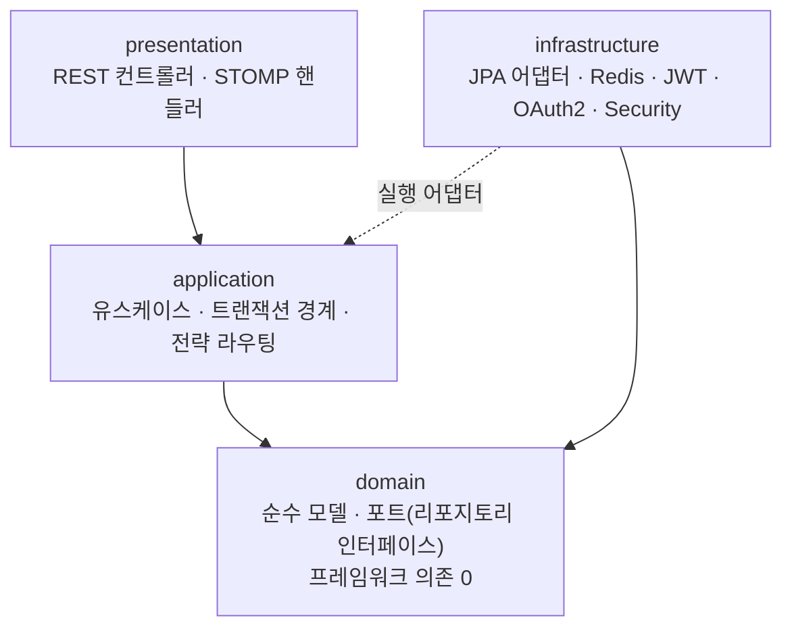
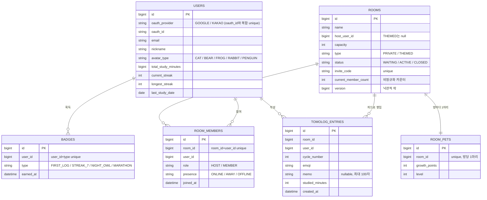

# tomolog — 실시간 스터디 룸 서버

친구끼리, 또는 모르는 사람들과 함께 공부하는 **실시간 스터디 룸 서버**다.
방에 모여 공유 포모도로 타이머로 같이 집중하고, 서로의 접속 상태를 실시간으로 보고, 한 사이클이
끝나면 공부 스냅샷(이모지 + 한 줄 메모 + 공부한 분)을 남겨 방 피드에 쌓는다.

매일 공부하면 스트릭이 오르고, 조건을 채우면 뱃지를 받고, 방마다 같이 키우는 펫이 자란다.

이 과제는 **서버만** 만드는 범위다. 프론트엔드는 없고, 대신 REST·STOMP·자동화 테스트로 모든
동작을 검증 가능하게 했다.

### 한눈에 보기

| 항목 | 내용 |
| --- | --- |
| 언어 / 런타임 | Java 21, Spring Boot 3.3 |
| 저장소 | PostgreSQL (Flyway 마이그레이션), Redis (분산 락) |
| 실시간 | STOMP over WebSocket |
| 인증 | OAuth2 (Google·Kakao) + JWT, STOMP CONNECT 인증 |
| 아키텍처 | 4계층 + 헥사고날 (순수 도메인 ↔ JPA 매퍼 분리) |
| 간판 기능 | **방 입장 동시성 제어** — 100명이 동시에 들어와도 정원은 절대 안 넘는다 |
| 게이트 | Spotless · Checkstyle · PMD · ArchUnit · JaCoCo · 동시성 합격 테스트 (CI 강제) |

---

## 설계 목표와 우선순위

처음 스펙(`SPEC.md`)을 잡을 때 목표 셋을 정하고 순서를 매겼다.

1. **동시성에서의 정확성** — 100명이 동시에 들어와도 방 정원은 절대 넘지 않는다. 이게 이
   프로젝트의 간판이다.
2. **백엔드 기술을 깔끔하게 보여주기** — 동시성 제어, 실시간 메시징, OAuth2, 계층형 테스트.
3. **실제 서비스처럼 읽히는 코드.**

정확성을 1순위로 둔 이유는 분명하다. 기능이 많아 보이는 것보다, **보이지 않는 곳에서 데이터가
안 깨지는 것**이 이 서비스의 본질이라고 봤기 때문이다.

아래 결정들은 모두 의사결정 원장(`docs/DECISIONS.md`)에 번호(LEDGER-xxx)로 근거와 함께 남겨 뒀다.

---

## 핵심 설계 결정

### 방을 두 종류로 나눴다 (LEDGER-008)

처음엔 방이 한 종류였다. "정원은 누가 정하나"를 고민하다 두 종류가 필요하다고 판단했다.

- **친구방(PRIVATE)** — 호스트가 만들고 정원을 직접 정한다. 최대 50명, 아는 사람끼리.
- **테마방(THEMED)** — 미리 만들어 둔 고정 5개의 큰 "장소"(분위기 좋은 카페, 제주 바다속 카페,
  심야 도서관, 루프탑 스터디, 숲속 오두막). 모르는 사람 다수가 모여 최대 2000명까지 같이 공부한다.

둘을 나눈 **진짜 이유는 동시성 성격이 다르기 때문**이다. 50명짜리 방은 행을 잠가 한 명씩 처리해도
충분하지만, 2000명이 한 방에 몰리면 그 방식은 병목이 된다. (자세한 건 [방 타입과 정원
제어](#방-타입과-정원-제어) 참고.)

> 모든 방을 같은 전략으로 처리하는 안, 아예 서비스를 물리적으로 쪼개는 안도 봤지만 — 전자는 큰
> 방에서 막히고 후자는 과제 범위에 과했다. 그래서 **방 종류에 따라 입장 전략만 갈아끼우는** 쪽으로
> 정했다.

### DB를 PostgreSQL로 바꿨다 (LEDGER-006)

원본 과제 스펙은 MySQL이었다. 나중에 Supabase·Neon 같은 매니지드 호스팅에 그대로 올릴 가능성을
열어두고 싶어 PostgreSQL로 바꿨다.

다만 매니지드 서비스의 인증·실시간 기능은 **일부러 쓰지 않고** OAuth2와 STOMP를 직접 구현했다 —
그게 이 과제에서 보여줘야 할 부분이라고 봤기 때문이다.

### 4계층 + 헥사고날로 갔다 (LEDGER-007, LEDGER-010)

핵심 규칙(정원·스트릭)이 JPA 엔티티 안에서 영속성 코드와 섞이는 게 싫었다.

그래서 계층을 `presentation / application / domain / infrastructure`로 나누고, **도메인은 순수
자바 객체로만** 뒀다. 엔티티를 그대로 도메인으로 쓰면 코드는 적지만, DB나 프레임워크가 바뀔 때
규칙까지 흔들리는 게 마음에 걸려 분리하는 쪽을 골랐다.

이 결정은 뒤에서 "더티 체킹 함정"이라는 대가를 치르게 했는데, 그 이야기는 [만들면서 부딪힌
문제들](#만들면서-부딪힌-문제들)에 적었다.

---

## 아키텍처

코드는 **위에서 아래로만** 의존한다. 가장 안쪽 `domain`은 아무것도 의존하지 않는다 — 스프링도
JPA도 모른다. 이 방향 규칙은 말로만 지키는 게 아니라 **ArchUnit 테스트로 강제**해서, 누가 실수로
거꾸로 의존하면 빌드가 깨진다.



패키지 구조:

```
com.tomolog
├── presentation    REST 컨트롤러 + STOMP 핸들러. 바깥과는 DTO(record)로만 주고받는다.
├── application     서비스(유스케이스). 트랜잭션 경계와 입장 전략 라우팅.
├── domain          순수 도메인 모델 + 포트(리포지토리 인터페이스). 프레임워크 의존 0.
└── infrastructure  바깥쪽 어댑터(안으로만 의존).
                    persistence(JPA 엔티티·매퍼·어댑터) / concurrency(입장 전략) / jwt·oauth·security
```

### 애그리거트 5조각 패턴

애그리거트마다 **도메인 모델 · 포트 · JPA 엔티티 · 매퍼 · 영속성 어댑터** 다섯 조각으로 나눴다.

예를 들어 방은 `domain/room/Room`이 규칙만 담고, 실제 저장은 `infrastructure/persistence/room`의
엔티티와 어댑터가 맡는다. 도메인은 자기가 정의한 포트 인터페이스만 알 뿐, 그 구현이 바깥에
있다는 사실조차 모른다.

### 한 요청이 흐르는 길 — 공부 스냅샷 제출

```
POST /api/rooms/{id}/logs            presentation — 컨트롤러가 요청 record를 풀어 넘긴다
        │
        ▼
LogService.submit (application, @Transactional)
   ├─ 방 멤버인지 확인        domain 포트: roomMemberRepository
   ├─ 스냅샷 저장            domain 포트: entryRepository.save → 어댑터 → DB
   ├─ 게이미피케이션 반영     gamificationService (스트릭·펫·뱃지 갱신)
   └─ NewLogEvent 발행       eventPublisher
                                 │
                                 ▼
              realtime 리스너가 받아 /topic/rooms/{id} 로 NEW_LOG 브로드캐스트
```

눈여겨볼 부분은, 스냅샷을 저장한 서비스가 **실시간 브로드캐스트를 직접 하지 않는다**는 점이다.
"새 로그가 생겼다"는 이벤트만 발행하고, 실제로 STOMP 토픽에 쏘는 건 realtime 리스너가 한다.

이렇게 떼어 둔 덕분에, 나중에 학습 리포트 같은 기능이 붙어도 이 이벤트를 하나 더 구독하면 될 뿐
저장 로직은 건드릴 필요가 없다.

---

## 데이터 모델 (ERD)

엔티티는 6개다. 관계는 **애플리케이션 레벨의 ID 참조**로만 잇고, JPA `@ManyToOne` 같은 매핑
연관은 두지 않았다 (이유는 아래 설계 의도에).



모든 엔티티는 `BaseTimeEntity`를 상속해 `id`(IDENTITY), `created_at`, `updated_at`을 공통으로 가진다.
스키마는 Flyway 마이그레이션(`src/main/resources/db/migration`, V1~V4)으로 관리한다.

### 이렇게 설계한 의도와 근거

**① 연관을 JPA 매핑이 아니라 ID 참조로 둔 이유.**
`room_members`는 `Room`이나 `User` 객체를 들고 있지 않고 `room_id`·`user_id`라는 `Long`만
들고 있다. 헥사고날에서 도메인 모델은 순수 POJO여야 하는데(LEDGER-010), `@ManyToOne`을 쓰면
영속성 관심사가 도메인까지 새어든다. ID 참조로 두면 애그리거트 경계가 또렷해지고, 대량 입장
시 연관 그래프를 끌고 오는 비용도 없다.

**② `rooms.current_member_count`를 따로 들고 있는 이유 (비정규화).**
정원 검사는 입장의 **핫패스**다. 매번 `room_members`를 `COUNT`하면 동시 입장마다 집계
부하가 걸린다. 그래서 현재 인원을 방 행에 카운터로 들고, **카운터 한 칸이 곧 임계 구간**이
되게 했다. 원자적 전략의 `... SET count = count + 1 WHERE count < capacity`가 이 한 칸 위에서
정원을 지킨다.

**③ `rooms.version`(낙관적 락)을 둔 이유.**
낙관적 락 전략이 충돌을 감지하려면 행 버전이 필요하다. 같은 카운터를 여러 전략이 서로 다른
방식(비관/낙관/분산/원자)으로 보호할 수 있게, 방 행에 락에 필요한 자리를 미리 마련해 둔 것이다.

**④ 스트릭·총 공부시간을 `users`에 둔 이유.**
스트릭은 "유저가 며칠 연속 공부했나"라서 방이 아니라 **사람에 종속**된다. 매번
`tomolog_entries`를 날짜별로 집계해 계산할 수도 있지만, 조회가 잦고 규칙(연속/리셋)이 단순해서
`current_streak`/`longest_streak`/`last_study_date`를 유저 행에 비정규화로 들고 제출 때마다
한 번에 갱신한다.

**⑤ 펫은 방당 1마리(`room_id` unique), 뱃지는 사람·종류당 1개(`user_id+type` unique).**
"같이 키우는 펫"은 방 단위 공동 소유라 방마다 정확히 하나여야 하고, 뱃지는 같은 종류를 중복
지급하면 안 된다. 이 두 규칙을 애플리케이션 로직이 아니라 **DB 유니크 제약**으로 박아, 동시
요청이 들어와도 중복이 물리적으로 불가능하게 했다. (입장의 `room_members(room_id, user_id)`
유니크도 같은 이유 — 중복 입장을 DB가 막는다.)

---

## 방 타입과 정원 제어

> **요구사항:** 방 스타일에 따라 제한 인원이 다르다. 친구방은 호스트가 정한 소규모(≤50),
> 테마방은 익명 다수의 대규모(2000). 그리고 **어떤 경우에도 정원을 넘으면 안 된다.**

이걸 어떻게 구현했는지, 정원이 정해지는 곳부터 지켜지는 곳까지 순서대로 정리한다.

### 1. 정원은 어디서 오나

| 방 타입 | 정원 | 출처 | 생성 경로 |
| --- | --- | --- | --- |
| **PRIVATE** | 2 ~ 50 (호스트 지정) | 클라이언트 입력 | `POST /api/rooms` |
| **THEMED** | 2000 (고정) | 서버 시드 | Flyway `V3` 마이그레이션으로 5개 사전 생성 |

상한은 도메인 상수로 못박혀 있다.

```java
// domain/room/Room.java
public static final int PRIVATE_MAX_CAPACITY = 50;
public static final int THEMED_MAX_CAPACITY = 2000;
```

친구방을 만들 때 클라이언트가 보낸 정원은 `RoomService.createRoom`에서 `2 ~ 50` 범위로
검증된다. 범위를 벗어나면 거절한다. 테마방은 REST로 만들 수 없고, 마이그레이션이 정확히
5개를 `capacity=2000, host=null`로 시드한다.

### 2. 타입이 입장 전략을 고른다

정원을 지키는 핵심은 입장(join) 시점이다. `RoomService.join`이 **방 타입을 보고 전략을
라우팅**한다.

```java
// application/room/RoomService.java
RoomJoinStrategy strategy =
    type == RoomType.THEMED
        ? joinStrategyResolver.strategyFor(JoinStrategyType.ATOMIC) // 대규모 → 원자적
        : joinStrategyResolver.active();                            // 친구방 → 설정된 전략
```

- **친구방(≤50)** — 설정값으로 비관/낙관/분산 중 하나를 쓴다. 행을 잠가 직렬화해도 인원이
  적어 충분하다.
- **테마방(2000)** — 무조건 **원자적 전략**. 2000명이 한 행에 몰리므로, 임계 구간이 가장 짧은
  방식이어야 한다.

### 3. 정원은 어떻게 지켜지나

친구방 전략은 잠근 상태에서 도메인 객체의 `isFull()`을 확인한 뒤 카운터를 올린다.

```java
// domain/room/Room.java
public boolean isFull() {
  return currentMemberCount >= capacity;
}
```

테마방의 원자적 전략은 검사·증가를 **한 문장**으로 합쳐 경합 창 자체를 없앤다.

```sql
UPDATE rooms SET current_member_count = current_member_count + 1
WHERE id = :id AND current_member_count < capacity
```

영향받은 행이 0이면 정원이 찬 것 → `RoomFullException`(HTTP 409). 카운터 증가와 멤버 삽입은
한 트랜잭션이라, 중복 입장으로 유니크 제약이 깨지면 롤백이 **예약한 자리까지 자동으로
되돌린다.** (이 자동 정리를 믿기까지의 삽질은 [문제들](#만들면서-부딪힌-문제들)에.)

---

## 동시성 제어

입장은 어떤 상황에서도 정원을 넘지 않아야 한다. 한 방법으로만 풀지 않고, **트레이드오프가 다른
네 전략**을 만들어 상황에 맞게 골라 쓰도록 했다.

| 전략 | 메커니즘 | 특징 / 실패 모드 | 처리량 | 언제 |
| --- | --- | --- | --- | --- |
| **비관적 락** | `SELECT ... FOR UPDATE`로 방 행을 잠그고 검사·삽입 | 같은 방 입장이 직렬화(락 대기). 가장 직관적·정확 | 중 | 정확성 우선, 일반 친구방 |
| **낙관적 락** | `@Version` + 충돌 시 백오프 재시도(최대 50회) | 경합 심하면 재시도 폭증. DB 락 없음 | 낮은 경합에서 높음 | 경합 낮은 환경 |
| **분산 락** | Redisson `RLock` (`lock:room:{id}`) | 서버 여러 대여도 직렬화. 락 대기·리스 타임아웃 | 중 | 다중 인스턴스 배포 |
| **원자적** | 조건부 단일 `UPDATE ... WHERE count < capacity` | 임계 구간이 한 문장이라 짧다 | 높음 | 대규모(2000) 테마방 |

네 전략은 **같은 합격 테스트**를 통과한다 — 정원 4명짜리 방에 100개 스레드가 동시에 달려들면
정확히 4명만 성공하고 96명은 거절되며, DB에도 정확히 4명만 남는다
(`AllStrategiesConcurrencyTest`).

> 멀티스레드 테스트는 `ExecutorService`와 `CountDownLatch`로 진짜 "동시 출발"을 만든다. 스레드를
> 먼저 전부 만들어 래치 앞에 세워 두고, 래치 하나를 열어 한꺼번에 출발시켜야 진짜 경합이 된다.

---

## 실시간 타이머

방마다 **공유 포모도로 타이머**가 돈다. 한 사람이 시작하면 그 방의 모두가 같은 시계를 본다.

| 항목 | 값 | 근거 |
| --- | --- | --- |
| 구동 | 서버 주도 — `@Scheduled(fixedRate = 1000)` 1초 틱 | `TimerScheduler` |
| 페이즈 | `FOCUS` 25분 / `BREAK` 5분 | `RoomLiveState.FOCUS_SECONDS / BREAK_SECONDS` |
| 상태 보관 | 방별 인메모리 `ConcurrentHashMap` (`ReentrantLock`으로 보호) | `RoomLiveStateRegistry` |
| 제어 | `START` / `PAUSE` / `SKIP` — **호스트만** | `TimerStompController` |
| 브로드캐스트 | `/topic/rooms/{id}` 로 `TIMER_TICK` · `TIMER_PHASE_CHANGED` | `RoomEventBroadcaster` |

동작은 이렇다. 서버 스케줄러가 1초마다 살아 있는 모든 방의 타이머를 한 칸씩 줄이고, 남은 시간을
`TIMER_TICK`으로 그 방 토픽에 쏜다. 25분이 다 되면 페이즈가 `FOCUS → BREAK`로 넘어가며
`TIMER_PHASE_CHANGED`를 쏜다. 클라이언트는 자기 시계를 돌리는 게 아니라 **서버가 보내주는
스냅샷**(`phase`, `remainingSeconds`, `running`)을 그대로 그리기만 하면 되므로, 방 안의 모두가
어긋남 없이 같은 시간을 본다.

제어(시작/일시정지/건너뛰기)는 `/app/rooms/{id}/timer/control`로 들어오는데, 보낸 사람이 그 방의
호스트일 때만 반영하고 아니면 조용히 무시한다.

> **타이머와 공부 기록은 일부러 느슨하게 묶었다.** 포커스가 끝났다고 서버가 자동으로 로그를
> 남기지는 않는다. 공부 스냅샷은 사용자가 명시적으로 `POST .../logs`로 제출하고, 그 제출이
> 스트릭·펫·뱃지를 갱신한다. 타이머는 "같이 보는 시계"의 역할에 집중하고, 무엇을 기록할지는
> 사용자가 정하게 한 것이다.

이 타이머는 **단일 서버 전제**라는 한계가 있다. 여러 인스턴스로 띄우면 인스턴스마다 틱을 쏴서
신호가 중복된다. 숨기지 않고 명시해 뒀다 (LEDGER-009, [아래](#고려했지만-안-만든-것)).

---

## 게이미피케이션 — 스트릭 · 펫 · 뱃지

공부 스냅샷 하나를 제출하면(`LogService.submit`) 한 트랜잭션 안에서 세 가지가 같이 일어난다:
**스트릭 갱신 → 방 펫 성장 → 뱃지 평가.**

### 스트릭 (사람 단위)

```java
// domain/user/User.java — recordStudy(minutes, today)
if (lastStudyDate == null || lastStudyDate.plusDays(1).equals(today)) {
  currentStreak = (lastStudyDate == null) ? 1 : currentStreak + 1; // 첫 공부 또는 어제→오늘
} else if (!lastStudyDate.equals(today)) {
  currentStreak = 1;                                               // 하루라도 비면 리셋
}
longestStreak = Math.max(longestStreak, currentStreak);
```

- **어제 공부했고 오늘 또** 하면 `+1`, **하루라도 비면** 1로 리셋.
- **같은 날 여러 번** 제출해도 스트릭은 그대로(중복 가산 없음). 날짜(`LocalDate`) 기준이라
  시각은 무관하다.
- `longestStreak`은 매 제출마다 최댓값으로만 갱신돼 절대 줄지 않는다.

### 방 펫 (방 단위 공동 육성)

펫은 방마다 한 마리이고, 그 방의 누군가 공부할 때마다 **공부한 분이 그대로 성장 포인트**가 된다.

```java
// domain/gamification/RoomPet.java
level = (growthPoints / 100) + 1;   // POINTS_PER_LEVEL = 100
```

성장은 동시 입장과 똑같이 경합한다. 그래서 원자적 카운터 UPDATE로 올려 50명이 동시에 공부해도
포인트가 새지 않는다 (`PetGrowthConcurrencyTest`로 검증).

### 뱃지 (사람·종류당 1개)

| 뱃지 | 조건 | 상수 |
| --- | --- | --- |
| `FIRST_LOG` | 첫 제출(이후 멱등) | — |
| `STREAK_7` | 현재 스트릭 ≥ 7일 | `STREAK_BADGE_DAYS = 7` |
| `NIGHT_OWL` | 00:00 ~ 04:59 사이 제출 | `NIGHT_OWL_END_HOUR = 5` |
| `MARATHON` | 한 번에 ≥ 120분 공부 | `MARATHON_MINUTES = 120` |

지급은 `user_id + type` 유니크 제약으로 멱등하다 — 조건을 또 만족해도 같은 뱃지는 한 번만
들어간다.

`GET /api/stats/me`는 이 결과를 모아 `currentStreak`, `longestStreak`, `totalStudyMinutes`,
획득 뱃지 목록을 돌려준다.

---

## 부하 테스트

간판 기능이 동시성이다 보니, "정원이 안 넘는다"를 합격 테스트 한 번으로 끝내기 아쉬웠다. 그래서
정확성이 보장되는 범위를 한참 넘겨, **어디까지 버티고 어디서 천장을 치는지**까지 밀어 봤다.

이 테스트는 몇 분씩 걸려 기본 빌드에선 태그로 빼 두고 `./gradlew stressTest`로 따로 돌린다
(`StressTest`, 스레드 풀 128개).

**실험 1 — 방 하나에 몰아넣기.** 정원 2000 테마방 하나에 시도를 `5천 → 1만 → 2만`으로 늘려
던졌다. 결과는 한결같았다. 몇 번을 던지든 방에 들어간 사람은 **정확히 2000명**, 초과 0명.
다만 처리량은 대략 **초당 500~750건** 근처에서 천장을 쳤다. 모두가 같은 방 행 하나를 갱신하려
줄을 서기 때문에, 그 행을 고치는 속도가 한계다.

**실험 2 — 방 여러 개로 흩뿌리기.** 같은 정원의 방 10개에 시도 3만 개를 라운드로빈으로 나눠
던졌다. 이번엔 합산 처리량이 **초당 약 4,163건**으로 한 방일 때보다 6배 가까이 올랐다. 방마다
들어간 인원도 전부 정확히 2000명. 행 잠금 병목이 방 단위로 흩어지니 전체 처리량이 따라 늘었다.

> 여기서 얻은 결론이 방을 두 종류로 나눈 결정과 이어진다. **정확성은 부하로 깨지지 않으니
> 안심하고, 처리량이 필요하면 큰 방 하나에 몰지 말고 여러 방으로 분산**하면 된다는 것을 숫자로
> 확인했다. (측정값은 로컬 환경 기준이라 절대 수치보다 경향이 핵심이다 — LEDGER-008.)

---

## 만들면서 부딪힌 문제들

결론만 적으면 매끄럽지만, 사실은 한참 헤맨 자리들이라 과정을 그대로 적는다.

**보상 코드가 오히려 카운터를 망가뜨린 일.**
원자적 입장에서 처음엔 카운터를 먼저 올리고, 멤버 삽입이 실패하면 올려둔 카운터를 다시 빼주는
"보상" 코드를 넣었다. 그런데 이게 트랜잭션 롤백과 겹치며 카운터가 오히려 틀어졌다. 한참
들여다보고서야, **증가와 삽입을 같은 트랜잭션에 묶으면 실패 시 롤백이 카운터까지 자동으로
되돌린다**는 걸 알았다. 그래서 보상 코드를 넣은 게 아니라 지웠다 (LEDGER-008).

**구조를 떼어내자 사라진 자동 저장.**
도메인을 순수 객체로 분리하니 함정이 생겼다. JPA 엔티티는 트랜잭션 안에서 값만 바꿔도 끝날 때
자동 저장되는데(더티 체킹), 순수 객체는 안 된다. 그래서 값을 바꾼 곳마다 저장을 직접 호출해야
했다. 더 까다로운 건 비관적 락이었다 — 락은 잠근 그 행을 끝까지 들고 있어야 의미가 있는데,
저장할 때 새 엔티티를 만들면 잠금이 끊긴다. 그래서 어댑터가 새로 만드는 대신, **이미 잠긴
엔티티를 같은 트랜잭션에서 다시 찾아 값만 덮어쓰게** 했다 (LEDGER-010).

```java
// RoomPersistenceAdapter.save — 이미 잠긴 엔티티를 다시 찾아 값만 적용
RoomEntity entity = jpaRepository.findById(room.getId()).orElseThrow(...);
entity.apply(room.getStatus(), room.getCurrentMemberCount());  // FOR UPDATE 락·버전 유지
```

**삭제와 카운터 갱신의 순서.**
테마방 퇴장은 멤버를 지우고 인원 카운터를 줄이는 대량 UPDATE를 쓴다. 그런데 이 대량 UPDATE는
영속성 컨텍스트를 비우기 때문에, 멤버 삭제가 아직 DB에 반영되지 않은 채 카운터만 줄이면 숫자가
어긋날 수 있었다. 그래서 **삭제를 먼저 flush해 반영한 뒤 카운터를 줄이도록** 순서를 잡고, 코드에
그 이유를 주석으로 남겼다.

**초록불을 너무 믿지 않기.**
"테스트가 통과한다고 이게 진짜 맞나?"를 가장 자주 생각했다. 그래서 가드가 정말 일하는지 일부러
부숴 봤다. 원자적 UPDATE에서 `WHERE count < capacity`만 빼니 2000짜리 방에 5000명이 그대로
들어오며 테스트가 빨갛게 떴다 — 그 한 줄이 진짜로 정원을 지키고 있었다는 증거다. 확인하고
되돌렸다. 도메인이 JPA에 손대면 빌드가 깨지는 ArchUnit 규칙도 같은 식으로 부숴서 확인했다
(LEDGER-010).

---

## 고려했지만 안 만든 것

**공유 타이머의 다중 인스턴스 리더 선출(ShedLock 같은 것)은 일부러 넣지 않았다.**
지금 타이머는 1초마다 틱을 쏘는데, 서버를 여러 대 띄우면 대마다 틱을 쏴서 같은 신호가 중복으로
나간다. 한 대만 틱을 쏘게 하는 방법은 있지만, 과제는 서버 한 대 기준이라 지금 넣으면 과한
설계다. 그래서 숨기지 않고 **"단일 서버 전제"라고 한계만 분명히 적어 두고**, 나중에 필요하면
들어갈 자리만 비워 뒀다 (LEDGER-009).

---

## 본인이 구현한 부분 & AI 활용

솔직히 적으면, 이 프로젝트는 AI 에이전트(Claude Code)를 적극 활용한 "바이브코딩"으로 만들었다.
코드 타이핑은 AI가 더 많이 했다. 다만 그냥 시킨 게 아니라, **AI가 멋대로 가지 못하도록 규칙을
먼저 깔고 그 안에서만 일하게 만든 방식**이 가장 공들인 부분이다.

먼저 운영 규칙(`CLAUDE.md`)과 빌드 스펙(`SPEC.md`)을 직접 설계했다. 핵심은 "증명할 수 있는 건
증명하고, 못 하는 건 사람에게 묻는다"였다. 그래서 모든 작업을 두 갈래로 나눴다 — 테스트·타입으로
검증되는 것(VERIFIED)과 내 도메인 판단에 기댄 것(ASSUMED). 후자는 코드에 표시하고
원장(`docs/DECISIONS.md`)에 남겨, 슬그머니 결정되는 게 없게 했다. 포맷·린트·복잡도·커버리지·아키텍처
검사를 자동 게이트로 묶어, 통과 못 하면 빌드 자체가 실패하게 만들었다.

이 구조 덕에 내 역할은 "코드를 받아치는 것"이 아니라 **"방향을 정하고 결과를 검증하고 틀린 걸
잡아내는 것"**이 됐다. 실제로 위에 적은 보상 코드 롤백 함정, 테마방 퇴장의 삭제·카운터 순서,
PR을 닫아버린 실수를 되돌린 것 모두 그렇게 잡아낸 자리다. 방을 두 종류로 나눌지, DB를
PostgreSQL로 바꿀지, 헥사고날까지 갈지 같은 결정도 전부 내가 내리고 근거를 원장에 적었다.

원본을 클론한 게 아니라 빈 저장소에서 처음부터 만들었기 때문에, 참고한 원본 URL은 없다.

---

## 실행 방법

```bash
docker compose up --build      # app + postgres + redis 가 함께 뜬다
```

- 앱: http://localhost:8080
- 실제 구글/카카오 키가 없어도, 로컬·테스트 프로필에서는 개발용 로그인으로 토큰을 받을 수 있다.

  ```bash
  curl -X POST localhost:8080/api/auth/dev-login -H 'Content-Type: application/json' -d '{"oauthId":"demo"}'
  # → {"accessToken":"...","tokenType":"Bearer"}  이후 Authorization: Bearer <token>
  ```
- 환경변수는 `.env.example`을 참고한다(시크릿은 절대 커밋하지 않는다).

---

## API 요약

전체 명세와 실행은 Swagger UI에서 볼 수 있다: http://localhost:8080/swagger-ui.html

| Method | Path | 설명 |
| --- | --- | --- |
| POST | `/api/auth/dev-login` | (local/test) 개발용 JWT 발급 |
| GET / PATCH | `/api/users/me` | 내 프로필 조회·수정 |
| POST / GET | `/api/rooms` | 방 생성 / 목록 |
| GET | `/api/rooms/{id}` | 방 상세(+멤버) |
| POST | `/api/rooms/{id}/join` | 동시성 보호 입장 |
| DELETE | `/api/rooms/{id}/members/me` | 퇴장 |
| POST / GET | `/api/rooms/{id}/logs` | 스냅샷 제출 / 피드 |
| GET | `/api/stats/me` | 스트릭·총시간·뱃지 |

**실시간(STOMP).** `/ws`로 접속(CONNECT 프레임에 JWT)하고 `/topic/rooms/{id}`를 구독하면
`MEMBER_JOINED` · `PRESENCE_UPDATED` · `NEW_LOG` · `TIMER_TICK` · `TIMER_PHASE_CHANGED` ·
`PET_GREW` 같은 이벤트가 온다. `/app/rooms/{id}/{chat|presence|timer/control}`로 채팅·접속상태·
타이머 제어를 보낸다.

---

## 테스트

```bash
./gradlew build         # 전체 게이트: 포맷·체크스타일·PMD·테스트·커버리지·ArchUnit (Docker 필요)
./gradlew stressTest    # 대규모 부하 탐색(단일 방 램프 + 멀티 방) — 기본 빌드엔 미포함
```

합격 기준이 되는 동시성 테스트는, 정원 4명 방에 100개 스레드를 동시에 출발시켜 정확히 4명만
성공하는지 확인하는 것이다. **네 전략 모두** 통과한다. 그 밖에 WebSocket 통합 테스트, 방펫 동시
성장, 스트릭·뱃지, REST 슬라이스 테스트가 있다.

커버리지 게이트는 핵심 패키지(`service`·`concurrency`·`gamification`) 라인 **≥ 80%**, 전체
**≥ 70%**를 강제하고, 실측 라인 커버리지는 약 **91%**다 (LEDGER-007/010 기록).

---

## 스크린샷

### Swagger UI (`/swagger-ui.html`)

전체 REST API 명세를 브라우저에서 바로 실행해 볼 수 있다.


### 동시성 합격 테스트

정원 4명 방에 100스레드를 동시에 출발시켜 정확히 4명만 성공함을 네 전략
(PESSIMISTIC·OPTIMISTIC·DISTRIBUTED·ATOMIC) 모두에서 검증한다.


### `docker compose up` 기동

한 번의 기동으로 app·postgres·redis가 모두 `healthy` 상태로 뜬다.


---

## CI

GitHub Actions(`.github/workflows/ci.yml`)가 JDK 21에서 전체 게이트를 돌리고 JaCoCo 리포트를
올린다. 기본 브랜치(`main`)에서 통과 상태다.
