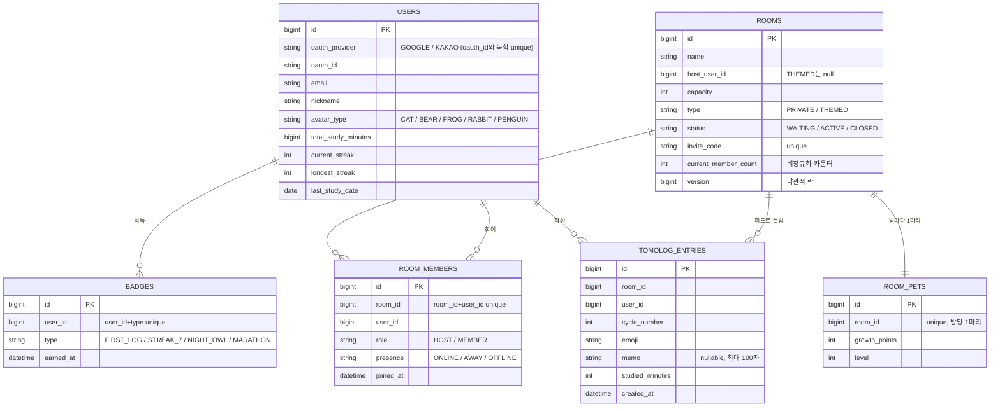

# 데이터 모델 (ERD)

엔티티는 6개다. 관계는 애플리케이션 레벨의 ID 참조로만 잇고, JPA `@ManyToOne` 같은 매핑 연관은
두지 않았다(이유는 아래). 스키마는 Flyway 마이그레이션(`src/main/resources/db/migration`,
V1~V4)으로 관리한다.

모든 엔티티는 `BaseTimeEntity`를 상속해 `id`(IDENTITY), `created_at`, `updated_at`을 공통으로 가진다.

---

## 컬럼별 설계 의도

**연관을 JPA 매핑이 아니라 ID 참조로 뒀다.**
`room_members`는 `Room`이나 `User` 객체가 아니라 `room_id`, `user_id`라는 `Long`만 들고 있다.
헥사고날에서 도메인 모델은 순수 POJO여야 하는데 `@ManyToOne`을 쓰면 영속성 관심사가 도메인까지
새어든다. ID 참조로 두면 애그리거트 경계가 또렷해지고, 대량 입장 시 연관 그래프를 끌고 오는
비용도 없다.

**`rooms.current_member_count`를 따로 들고 있다(비정규화).**
정원 검사는 입장의 핫패스다. 매번 `room_members`를 COUNT하면 동시 입장마다 집계 부하가 걸린다.
현재 인원을 방 행에 카운터로 들고, 카운터 한 칸이 곧 임계 구간이 되게 했다. 원자적 전략의
`SET count = count + 1 WHERE count < capacity`가 이 한 칸 위에서 정원을 지킨다.

**`rooms.version`(낙관적 락)을 뒀다.**
낙관적 락 전략이 충돌을 감지하려면 행 버전이 필요하다. 같은 카운터를 여러 전략이 서로 다른
방식으로 보호할 수 있도록, 방 행에 락에 필요한 자리를 미리 마련했다.

**스트릭·총 공부시간을 `users`에 뒀다.**
스트릭은 사람이 며칠 연속 공부했는지라 방이 아니라 사람에 종속된다. 매번 로그를 날짜별로 집계해
계산할 수도 있지만, 조회가 잦고 규칙이 단순해서 `current_streak`/`longest_streak`/`last_study_date`를
유저 행에 비정규화로 들고 제출 때 한 번에 갱신한다.

**펫은 방당 1개, 뱃지는 사람·종류당 1개를 DB 제약으로 박았다.**
같이 키우는 펫은 방마다 정확히 하나여야 하고(`room_pets.room_id` unique), 같은 뱃지를 중복
지급하면 안 된다(`badges.user_id+type` unique). 이 규칙을 애플리케이션 코드가 아니라 DB 유니크
제약으로 박아, 동시 요청이 들어와도 중복이 물리적으로 불가능하게 했다. 입장의
`room_members(room_id, user_id)` 유니크도 같은 이유로, 중복 입장을 DB가 막는다.
